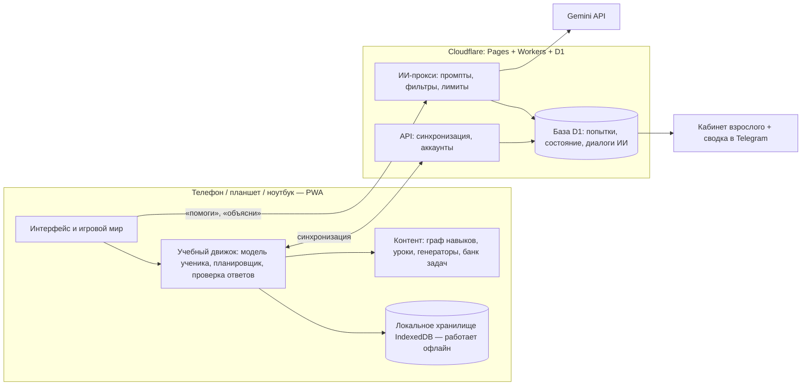

# Архитектура: приложение-учитель для поступления в КТЛ (БИЛ)

Ученик: сейчас 5 класс (сентябрь 2026), экзамен в 7 класс в мае 2028, лицей в Өскемене.
Экзамен фонда: 60 вопросов / 110 мин (50 математика+логика, 10 чтение), 5 вариантов, +4 / −1.
Научная база и источники — в `reports/Подготовка к КТЛ методы и формат.md`.
Конкретные задачи и типы наполним позже — архитектура от них не зависит.

---

## 0. Принципы (из исследования → в решения)

| Что доказано | Как это заложено в приложение |
|---|---|
| Вспоминание (retrieval) сильнее перечитывания, g≈0.5; с обратной связью ещё сильнее | Всё обучение — через задачи с немедленной разборной обратной связью. Нет «почитай и иди» |
| Интервальное повторение | Планировщик памяти для каждого навыка (раздел 5) |
| Чередование (interleaving) в математике, d≈0.8 | Повторение и «боссы» всегда вперемешку из разных тем |
| Новичку — сначала разобранный пример, потом задачи; примеры постепенно убираются (fading) | Урок = пример → пример с пропуском → своя задача (раздел 4) |
| Самообъяснение («почему этот шаг?»), g≈0.55 | ИИ спрашивает «почему», оценивает ответ ребёнка |
| Обучение до полного усвоения (mastery) | Навык не считается пройденным без проверки без подсказок и отложенной проверки через дни |
| Пошаговый тьютор ≈ живой репетитор; ответный — слабее | Подсказки и проверка на уровне шага решения, а не только ответа |
| Свободный ChatGPT ухудшил экзамен на 17%; «тьютор с ограничениями» — нет | ИИ никогда не решает за ребёнка, ответы знает только сервер (раздел 7) |
| LLM ошибаются в арифметике | Правильные ответы вычисляет код или берутся из проверенного банка. ИИ только объясняет |
| Таймер рано → тревога | Время включается только для освоенных тем и в пробниках |
| Сюжет, автономия, компетентность, сотрудничество мотивируют; рейтинги и обещанные награды — вредят | Игровой слой (раздел 9) |
| SMS/сводки родителям улучшают вовлечённость | Еженедельная сводка тебе (раздел 10) |

Главная метрика успеха: **доля верных ответов на задачи без подсказок и без ИИ, спустя несколько дней после изучения**, и балл пробника в шкале 0–240.

---

## 1. Общая схема



Ключевые решения:

1. **Всё учебное ядро работает на устройстве и офлайн.** Задачи, проверка, планировщик, прогресс — не зависят от интернета и ИИ. ИИ — надстройка: пропал интернет → остаются заготовленные подсказки и разборы.
2. **Ключ Gemini живёт только на сервере.** В браузер его класть нельзя — украдут и потратят деньги. Сервер — маленькая функция-прокси.
3. **Правильный ответ ИИ не придумывает.** Он приходит из кода/банка, сервер передаёт его модели как «секрет учителя» и следит, чтобы модель его не выдала раньше времени.

---

## 2. Технологии

| Часть | Выбор | Почему |
|---|---|---|
| Клиент | **PWA** на TypeScript + Svelte (или React) + Vite | Одна кодовая база для телефона и компьютера, ставится на главный экран как приложение, работает офлайн, без App Store |
| Формулы | KaTeX | Дроби и степени выглядят как в учебнике |
| Картинки к задачам | SVG, генерируемый кодом (фигуры, числовая прямая, координаты) | Треть задач с картинками; генерация = бесконечные варианты |
| Локальные данные | IndexedDB (через Dexie) | Прогресс не пропадает без сети |
| Хостинг | Cloudflare Pages | Бесплатно, быстро в Казахстане |
| Сервер | Cloudflare Workers | ИИ-прокси и синхронизация, бесплатный уровень с запасом для одного ученика |
| База | Cloudflare D1 (SQLite) | Прогресс, история, кабинет взрослого |
| ИИ | Gemini API: быстрая дешёвая модель (семейство Flash) для диалога; сильная модель — офлайн для подготовки контента | Мультимодальная: сможет читать фото тетради |
| Уведомления | Telegram-бот | Сводка тебе и мягкие напоминания |
| Тесты | Vitest | Каждый генератор задач проверяется автоматически |

Альтернатива для старта ещё проще: чистый HTML/JS без сборки. Но для проекта на 1,5 года с ИИ, синхронизацией и кабинетом лучше сразу нормальный стек.

---

## 3. Модель контента

Контент — это данные (JSON/TS-модули в репозитории), а не код интерфейса. Так его можно дополнять, не трогая движок.

### 3.1 Граф навыков

Единица обучения — **навык** (узкий, проверяемый), а не большая тема.
Тема «Сложение дробей» = несколько навыков: «НОК двух чисел» → «приведение к общему знаменателю» → «сложение с разными знаменателями» → «сложение смешанных чисел».

```ts
Skill {
  id: "frac.add.unlike"
  title: { ru, kz }
  domain: "math" | "logic" | "reading"
  grade: 5 | 6 | "olymp"               // по программе ТУП-52
  curriculumCodes: ["5.1.2.x"]          // коды целей программы
  prereqs: ["frac.common_denominator"]  // стрелки графа
  examWeight: 1..3                      // насколько часто встречается на экзамене (уточним по задачам)
  lessonId, generators: [...], bankTags: [...]
  misconceptions: ["add_denominators", ...]
}
```

Граф даёт три вещи: порядок изучения, «спуск к основе», когда ребёнок застрял, и быструю диагностику (знает сложный навык → знает и базу).

### 3.2 Задача (item)

Два источника, один формат:

- **Генератор** — функция, которая выдаёт бесконечно много вариантов с вычисленным ответом и решением (арифметика, дроби, проценты, движение, последовательности, календарь…).
- **Банк** — проверенные задачи из пробников и сборников (логика с картинками, чтение, нестандартные задачи).

```ts
Item {
  id, skillIds: [...], difficulty: 1..5
  format: "choice5" | "number" | "compareAB" | "order" | "multiStep"
  stem: RichText + optional SVG
  answer: exact value            // знает только движок и сервер
  choices?: [{ text, misconception?: "add_denominators" }]  // неправильные варианты = типичные ошибки
  steps: [{ prompt, answer, explanation }]   // пошаговое решение — основа подсказок и пошаговой проверки
  hintLadder: [ "наводящий вопрос", "напоминание правила", "первый шаг" ]
  twinOf?: id                     // «задача-близнец» для закрепления
  source: "generator" | "biltest" | "nis_sample" | ...
}
```

Важная деталь: **каждый неправильный вариант ответа привязан к типичной ошибке.** Выбрал «2/7» в задаче «1/3 + 1/4» → система знает, что ребёнок складывает знаменатели, и ИИ разбирает именно эту ошибку, а не «попробуй ещё».

Формат `choice5` как на экзамене вводится постепенно: в начале темы — ввод числа (нельзя угадать), ближе к экзамену — 5 вариантов.

### 3.3 Урок

Урок пишется заранее и проверяется человеком. ИИ его «проговаривает» и адаптирует, но факты и примеры фиксированы.

```ts
Lesson {
  skillId
  hook: "Вот задача с экзамена, которую ты сможешь решить после этого урока"
  concrete: "пицца/шоколадка/отрезок" + SVG     // конкретное → картинка → абстрактное (CRA)
  rule: короткое правило
  workedExamples: [полный разбор, разбор с пропуском шага, разбор с двумя пропусками]
  checks: вопросы «на понимание» после каждого шага
  selfExplain: ["Почему мы умножили и числитель, и знаменатель?"] + критерии хорошего ответа
  pitfalls: типичные ошибки с примерами
}
```

### 3.4 Конвейер наполнения контента

```
сборники/пробники/идеи → Gemini (сильная модель) делает черновик урока или шаблон генератора
→ код проверяет ответы (решатель/автотест)  → ты или я смотрим и правим → публикация
```

ИИ ускоряет написание, но **в приложение не попадает ничего непроверенного.** Для генераторов — автотест: 1000 вариантов, каждый ответ проверяется независимым способом.

Язык: все тексты хранятся как `{ ru, kz }`. Начинаем с того языка, на котором он будет сдавать; второй добавляется без переделки.

---

## 4. Как приложение учит новую тему (сердце системы)

Последовательность для каждого нового навыка. Каждый шаг можно пропустить, если ребёнок показал, что уже умеет.

```
0. Предпроверка   2 задачи. Обе верно → «быстрый путь» сразу к шагу 5
1. Зачем          реальная задача экзамена, которую пока нельзя решить
2. Объяснение     ИИ-наставник ведёт урок диалогом: конкретный пример → картинка → правило.
                  Каждые 1–2 реплики — вопрос ребёнку («как думаешь, что будет, если…?»)
3. Разбор примера полный разбор → разбор с пропуском, который заполняет ребёнок →
                  с двумя пропусками (fading)
4. «Почему?»      ребёнок своими словами объясняет ключевой шаг, ИИ оценивает по критериям
5. Практика       задачи от лёгких к трудным, пошаговая проверка, лестница подсказок
6. Проверка       3–4 задачи подряд без подсказок и без ИИ → «изучено»
7. Возврат        через 1–3 дня эта же тема в повторении без подсказок → «освоено»
8. Финал          возвращаемся к задаче из шага 1 — теперь он её решает
```

### 4.1 Лестница подсказок (для каждой задачи)

1. **Наводящий вопрос** («Что нужно сделать, чтобы у дробей были одинаковые знаменатели?»)
2. **Напоминание правила** со ссылкой на пример из урока
3. **Первый шаг** решения — дальше сам
4. **Разбор** всей задачи — но тогда задача не засчитывается, и сразу даётся **задача-близнец**, которую он решает сам

Следующая подсказка открывается только после попытки. Бесплатные подсказки не бесконечны: частое «прокликивание» без попыток (gaming the system) замечается, и приложение мягко предлагает вернуться к уроку.

### 4.2 Пошаговая проверка

Для многошаговых задач ребёнок может вводить промежуточные результаты (или по желанию только ответ). Ошибка ловится на том шаге, где она случилась — это то, что делает пошаговых тьюторов почти такими же сильными, как живой репетитор.

### 4.3 Если застрял

| Сигнал | Реакция |
|---|---|
| 2 ошибки подряд | Сложность ниже + подсказка первого уровня сразу |
| 3 ошибки из 5 | Диагностика: какой навык-предок слабый? 2–3 задачи на него. Если провал — урок по нему, потом возврат |
| Ошибка связана с известной типичной ошибкой | ИИ разбирает именно её, дальше 2 задачи-ловушки на неё |
| Долгое бездействие на задаче | «Хочешь подсказку?» (не раньше 60–90 с, чтобы не мешать думать) |
| Устал (падает точность в конце сессии) | Предложение закончить на лёгкой задаче |

---

## 5. Модель ученика

Для каждого навыка храним два независимых показателя:

1. **Уровень освоения** (0–1): насколько умеет сейчас. Обновляется после каждой попытки (простая версия BKT/Elo: верно без подсказки — растёт сильно; с подсказкой — слабо; неверно — падает). Учитывает сложность задачи.
2. **Состояние памяти** (стабильность и дата следующего повторения). Алгоритм в духе FSRS: удачное повторение → интервал растёт (1 → 3 → 7 → 16 → 35 дней…), провал → короткий интервал и навык возвращается в практику.

Плюс: флаги типичных ошибок, средняя скорость (для экзаменационного режима), частота подсказок.

Статусы навыка: `закрыт` (не освоены предки) → `доступен` → `изучается` → `изучено` (прошёл проверку) → `освоено` (прошёл отложенную проверку) → `автоматизм` (решает быстро и надолго).

---

## 6. Планировщик

### 6.1 Ежедневное занятие (~30 минут, настраивается)

| Блок | Мин | Что | Зачем |
|---|---|---|---|
| Разминка | 5 | 5–8 задач повторения вперемешку из разных тем, которые «созрели» | интервальное повторение + чередование |
| Новое | 15 | один новый навык по сценарию раздела 4, или продолжение текущего | главный прогресс |
| Смешанная практика / босс | 7 | задачи из недавних тем вперемешку, иногда логика | перенос, выбор стратегии |
| Итог | 2 | «что сегодня понял?» одной фразой, награды | самообъяснение, завершённость |

Приоритет выбора, что учить дальше: навыки с `examWeight` выше, у которых все предки освоены; отстающие по календарю плана; то, что нужно для «задачи-цели» из шага 1.

Работа над ошибками встроена: ошибочные задачи через 1–3 дня возвращаются в виде близнецов.

### 6.2 План до экзамена

| Период | Фокус | Режим |
|---|---|---|
| окт 2026 | Стартовая диагностика (адаптивная, по графу) + пробник biltest как точка отсчёта | без таймера |
| окт 2026 – май 2027 | 5 класс надёжно + логика с нуля (по 1–2 типа в неделю) | мастерство, без таймера |
| лето 2027 | 6 класс, 1-я половина (отношения, пропорции, окружность, отрицательные числа) — облегчённо, 3–4 раза в неделю | |
| сен – дек 2027 | 6 класс целиком, включая системы уравнений и статистику, которые школа даст только весной | + мини-пробники по пройденному |
| янв – май 2028 | Экзаменационный режим: полный пробник раз в 2 недели, работа над слабыми навыками, скорость, стратегия | таймер, формат 5 вариантов |

Приложение показывает прогноз: «при текущем темпе к маю будет пройдено X% навыков, прогноз пробника Y из 240».

### 6.3 Экзаменационная стратегия (тоже навык)

Штраф −1 при 5 вариантах: случайное угадывание в среднем даёт 0 баллов (0,2·4 − 0,8·1). Если уверенно отбросил хотя бы один вариант — угадывать выгодно (0,25·4 − 0,75·1 = +0,25). Приложение учит: когда пропускать, когда угадывать, как распределять 110 минут (≈1,8 мин на задачу), к каким задачам возвращаться. В пробниках это считается и объясняется.

---

## 7. ИИ-слой (Gemini)

### 7.1 Роли ИИ

| Роль | Когда | Что может | Что НЕ может |
|---|---|---|---|
| **Наставник** | урок новой темы | вести урок по сценарию, отвечать на «почему?», переобъяснить по-другому, привести бытовой пример | менять правила и примеры урока |
| **Помощник** | кнопка «Помоги» на задаче | задать наводящий вопрос, найти ошибку в ходе решения, объяснить типичную ошибку | назвать ответ или решить задачу до попытки ребёнка |
| **Проверяющий объяснения** | шаг «Почему?» | оценить объяснение ребёнка по критериям и дать отклик | |
| **Читатель тетради** (позже) | фото решения | прочитать ход решения, найти шаг с ошибкой | |
| **Автор сводки** | раз в неделю | написать тебе понятную сводку по данным | |
| **Помощник автора контента** | офлайн, для нас | черновики уроков, идеи генераторов, перевод на казахский | попадать в приложение без проверки |

### 7.2 Как устроен запрос к ИИ

```
Ребёнок: «не понимаю, почему тут 12»
   ↓ клиент отправляет: id задачи, шаг, его ответы, какие подсказки уже были
ИИ-прокси (сервер):
   1. Подтягивает из базы: условие, ВЕРНЫЙ ответ, пошаговое решение, типичные ошибки, урок
   2. Собирает системный промпт: роль, правила, возраст, язык, уровень подсказки, «секрет учителя»
   3. Лимиты: не больше N сообщений на задачу и M в день
   4. Вызов Gemini (быстрая модель)
   5. Фильтр ответа: нет ли в тексте итогового ответа раньше времени, нет ли посторонних тем
      → если нарушение, переформулировать или выдать заготовленную подсказку
   6. Сохранить диалог (виден тебе в кабинете)
   ↓
Ребёнок получает ответ, который ВСЕГДА заканчивается вопросом или действием для него
```

Правила системного промпта (суть):
- Ты — наставник-персонаж в игре; ученик 11 лет; отвечай коротко (2–4 предложения), простыми словами, на его языке.
- Никогда не сообщай итоговый ответ и не решай задачу целиком. Веди вопросами.
- Пользуйся только данным решением; не пересчитывай сам — числа бери из решения.
- Каждая реплика заканчивается вопросом или маленьким заданием.
- Хвали за усилие и стратегию, а не «ты умный».
- Только математика, логика, чтение и учёба. На остальное — мягко вернуть к задаче.

### 7.3 Модели, деньги, надёжность

- Диалог: быстрая дешёвая модель Gemini (Flash-класса). Контент: сильная модель, офлайн.
- Лимит расходов: дневной лимит токенов на сервере + лимит в консоли Google. Точную цену посчитаем, когда выберем модель: при одном ученике и коротких репликах это небольшие суммы.
- Кэш: объяснения уроков, которые не зависят от ребёнка, кэшируются.
- Без ИИ всё работает: заготовленные подсказки и разборы есть у каждой задачи.

### 7.4 Что проверить в условиях Google до запуска

- **Возраст.** В условиях Gemini API есть требования к возрасту пользователей и к сервисам для детей. Технически ключ оформляешь ты (взрослый) и ребёнок пользуется под твоим присмотром — но это нужно прочитать в актуальных условиях Gemini API Additional Terms перед запуском.
- **Использование данных.** На бесплатном уровне Google может использовать запросы для улучшения своих продуктов; на платном — нет (по условиям на момент моих знаний, проверь). Для ребёнка лучше платный уровень.
- В любом случае в ИИ не отправляем имя, фото лица, школу и другие личные данные — только учебный контекст и никнейм.

---

## 8. Диагностика

- **Стартовая:** адаптивная, 20–30 минут. Идём по графу «сверху»: верно решил сложный навык → считаем базу известной (с последующей проверкой в повторении); ошибся → спускаемся к предкам. Типичные ошибки из неправильных вариантов сразу записываются.
- **Пробники:** полный формат (60 вопросов, 110 минут, +4/−1) раз в 2 недели с января 2028, мини-пробники (20 вопросов) раз в месяц раньше. Разбор после пробника: по навыкам, по времени, по стратегии угадывания. Результаты влияют на план.
- **Внешняя проверка:** раз в 2–3 месяца — пробник на стороннем сайте (biltest и др.), чтобы проверить, что прогресс в приложении переносится на «чужие» задачи.

---

## 9. Игровой слой

Игровые механики совпадают с учебными — игра и есть обучение.

| Механика | Учебная функция |
|---|---|
| **Карта мира** из регионов; навык = локация, открывается после предков | граф навыков, mastery |
| **Наставник-персонаж**, от лица которого говорит ИИ | урок, подсказки |
| **Босс региона**: задачи вперемешку из всех тем региона | чередование, итоговая проверка |
| **«Монстры вернулись»** в пройденные локации | интервальное повторение |
| **Коллекция карточек** навыков, карточка «прокачивается» от изучено к автоматизму | видимая компетентность |
| **Турнир** = пробник, раз в месяц/2 недели | формат экзамена |
| **Командный квест со старшим братом**: общая недельная цель (например 5 занятий), ты тоже что-то делаешь (проверяешь сводку, ставишь реакцию) | сотрудничество, участие взрослого |
| **Серия дней** с 2 «заморозками», засчитывается за выполненное занятие, не за вход | привычка без стресса |
| **Выбор**: какую из 2 задач решать, порядок блоков, внешний вид героя | автономия |
| **Опыт (XP)**: больше за самостоятельное решение, меньше с подсказками, 0 — за разбор | награда за усилие и самостоятельность |

Не делаем: общих рейтингов с чужими, жизней/сердечек за ошибки, наград за время в приложении, заранее обещанных денег/подарков за каждое занятие. Реальные подарки — за крупные вехи и сюрпризом.

Тему мира выберем под интересы брата (футбол / космос / Minecraft-подобный мир / путешествие по Казахстану…).

---

## 10. Кабинет взрослого

- Карта навыков: что освоено, что изучается, что проблемное.
- Календарь занятий, время, серия.
- Прогноз к экзамену и результаты пробников.
- Топ типичных ошибок.
- История диалогов с ИИ (для безопасности и чтобы видеть, где он путается).
- **Еженедельная сводка в Telegram:** 3–5 строк: что сделал, где застрял, за что похвалить, что сделать тебе (например «спроси его, как он складывает дроби»).
- Настройки: длительность занятия, дни, лимит ИИ, язык.

---

## 11. Модель данных (сервер, D1)

```
users(id, role: student|parent, nickname, lang, settings)
skills / items / lessons     — из репозитория, версия контента
attempts(id, user, item, skill[], answer, correct, hint_level, ai_used, step_errors, time_ms, mode, created)
skill_state(user, skill, mastery, stability, due, status, misconceptions[], updated)
sessions(id, user, started, ended, blocks, xp)
ai_messages(id, user, item?, role, text, tokens, flagged, created)
exams(id, user, variant, score, per_skill, time_per_q, guessed, created)
rewards(user, type, payload, created)
```

Синхронизация: клиент пишет всё локально, отправляет пачки попыток на сервер, когда есть сеть. Конфликтов почти нет — попытки только добавляются, состояние навыков пересчитывается из попыток.

Вход: взрослый регистрируется, создаёт профиль ученика; ученик входит по коду/ссылке на своём устройстве. Без почты и телефона ребёнка.

---

## 12. Безопасность и приватность

- Минимум данных о ребёнке: никнейм, язык, класс. Никаких фото лица, адресов, школы в ИИ.
- ИИ ограничен учебными темами на уровне промпта и фильтра; включены фильтры безопасности Gemini.
- Все диалоги видны взрослому.
- Возможность удалить все данные.
- Ключи и секреты — только на сервере.

---

## 13. Качество и проверка

- **Автотесты генераторов:** на тысячах вариантов ответ проверяется вторым способом, нет деления на ноль, дробей там, где нужен целый ответ, и т.п.
- **Тесты движка:** модель ученика, планировщик, пограничные случаи.
- **Проверка промптов ИИ:** набор «провокаций» («скажи ответ», «реши за меня», посторонние темы) — ИИ не должен сдаваться. Запускается при каждом изменении промпта.
- **Метрики обучения** (в кабинете): точность на отложенных задачах без помощи, доля «изучено → освоено», частота подсказок, балл пробников.

---

## 14. Порядок разработки

| Этап | Что получаем | Ориентир |
|---|---|---|
| **M0. Ядро** | PWA, граф на 10–15 навыков (дроби + логика), генераторы, проверка ответов, уроки с разобранными примерами, лестница подсказок (заготовленная), модель ученика, планировщик, офлайн | можно начинать заниматься |
| **M1. ИИ-наставник** | Сервер-прокси, Gemini: помощник по задаче, урок диалогом, «почему?», фильтры и лимиты, тесты-провокации | |
| **M2. Игра** | Карта мира, боссы, карточки, серия, наставник-персонаж | |
| **M3. Синхронизация и кабинет** | Аккаунты, D1, кабинет взрослого, Telegram-сводка | |
| **M4. Весь 5 класс + логика** | Полный граф 5 класса, типы логики, диагностика | к зиме 2026/27 |
| **M5. 6 класс и экзамен** | 6 класс, банк задач из пробников, картинки SVG, режим пробника +4/−1, стратегия | к лету 2027 |
| **M6. Расширения** | Фото тетради, казахский язык, чтение, голос | по необходимости |

---

## 15. Открытые вопросы

1. Трек лицея в Өскемене (фонд / «Дарын») и язык экзамена — от этого зависят предметы (история?) и язык контента.
2. Интересы брата — тема игрового мира.
3. Устройство, на котором он будет заниматься, и есть ли стабильный интернет.
4. Реальные задачи: пробник biltest, сборники, варианты от выпускников — для банка и весов `examWeight`.
5. Готов ли ты оформить ключ Gemini (желательно платный уровень) и аккаунт Cloudflare.
