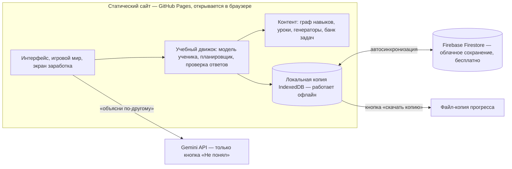

# Архитектура: сайт-подготовка к поступлению в КТЛ (БИЛ)

Ученик: сейчас 5 класс (сентябрь 2026), экзамен в 7 класс в мае 2028, лицей в Өскемене.
Экзамен фонда: 60 вопросов / 110 мин (50 математика+логика, 10 чтение), 5 вариантов, +4 / −1.
Научная база и источники — в `reports/Подготовка к КТЛ методы и формат.md`.
Конкретные задачи и типы наполним позже — архитектура от них не зависит.

Главные решения:

1. **Всё учебное заготовлено заранее и проверено**: уроки, примеры, подсказки, решения, разборы ошибок. ИИ — только кнопка «Не понял, объясни по-другому».
2. **Простой сайт для одного ученика**, старший брат рядом. Без аккаунтов для чужих, без своего сервера.
3. **Прогресс сохраняется бесплатно в облаке** (Firebase) + резервная копия в файл.
4. **Система заработка игрового времени**: в будни — час на сегодня и доля выходных часов.

---

## 0. Принципы (из исследования → в решения)

| Что доказано | Как это заложено в сайт |
|---|---|
| Вспоминание (retrieval) сильнее перечитывания, g≈0.5; с обратной связью ещё сильнее | Всё обучение — через задачи с немедленным разбором. Нет «почитай и иди» |
| Интервальное повторение | Планировщик памяти для каждого навыка (раздел 5) |
| Чередование (interleaving) в математике, d≈0.8 | Повторение и «боссы» всегда вперемешку из разных тем |
| Новичку — сначала разобранный пример, потом задачи; примеры постепенно убираются (fading) | Урок = пример → пример с пропуском → своя задача (раздел 4) |
| Самообъяснение («почему этот шаг?»), g≈0.55 | Карточки «объясни брату» + выбор верного объяснения из вариантов |
| Обучение до полного усвоения (mastery) | Навык не пройден без проверки без подсказок и отложенной проверки через дни |
| Пошаговый тьютор ≈ живой репетитор | Подсказки и проверка на уровне шага решения |
| Тьютор с заранее прописанными решениями — сильный; свободный ChatGPT — вредит (−17% на экзамене) | Контент заготовлен, ИИ только переобъясняет и никогда не решает |
| LLM ошибаются в арифметике | Ответы вычисляет код или берутся из проверенного банка |
| Таймер рано → тревога | Время включается только для освоенных тем и в пробниках |
| Сюжет, автономия, компетентность, сотрудничество мотивируют; рейтинги и награды «за участие» вредят | Игровой слой (раздел 8) и правила заработка (раздел 9) |
| Живой человек рядом — самый сильный «тьютор» | Сайт подсказывает брату, когда подключиться |

Главная метрика: **доля верных ответов без подсказок, спустя несколько дней после изучения**, и балл пробника в шкале 0–240.

---

## 1. Общая схема



- Сервера своего нет. Сайт — набор файлов на GitHub Pages (бесплатно).
- Всё учебное ядро работает в браузере и офлайн.
- Firebase хранит прогресс: сохраняется после каждого ответа, при отсутствии сети — досохраняет позже.
- Gemini вызывается прямо из браузера. Ключ вводится один раз в настройках, хранится только в этом браузере и не попадает в код/репозиторий. В Google Cloud ключ ограничивается адресом сайта и лимитом расходов.

---

## 2. Технологии

| Часть | Выбор | Почему |
|---|---|---|
| Сайт | TypeScript + Svelte + Vite | Лёгкий, быстрый, удобно поддерживать 1,5 года |
| Формулы | KaTeX | Дроби и степени как в учебнике |
| Картинки к задачам | SVG, генерируемый кодом | Фигуры, числовая прямая, координаты — бесконечные варианты |
| Локальные данные | IndexedDB (Dexie) | Работает без сети |
| Облако | Firebase Firestore + вход через Google (бесплатный план Spark) | Не теряется прогресс, без своего сервера |
| Хостинг | GitHub Pages | Бесплатно, деплой при каждом пуше |
| ИИ | Gemini API, быстрая дешёвая модель | Только переобъяснение по кнопке |
| Тесты | Vitest | Автопроверка генераторов задач и движка |

---

## 3. Модель контента

Контент — данные (TS/JSON-модули в репозитории), а не код интерфейса.

### 3.1 Граф навыков

Единица обучения — **навык** (узкий, проверяемый).
Тема «Сложение дробей» = «НОК» → «приведение к общему знаменателю» → «сложение с разными знаменателями» → «сложение смешанных чисел».

```ts
Skill {
  id: "frac.add.unlike"
  title: { ru, kz }
  domain: "math" | "logic" | "reading"
  grade: 5 | 6 | "olymp"               // по программе ТУП-52
  curriculumCodes: ["5.1.2.x"]
  prereqs: ["frac.common_denominator"]
  examWeight: 1..3                      // уточним по реальным задачам
  lessonId, generators: [...], bankTags: [...]
  misconceptions: ["add_denominators", ...]
}
```

Граф даёт: порядок изучения, «спуск к основе», когда застрял, быструю диагностику.

### 3.2 Задача

Два источника, один формат:

- **Генератор** — функция, выдающая бесконечно много вариантов с вычисленным ответом и решением (арифметика, дроби, проценты, движение, последовательности, календарь…).
- **Банк** — проверенные задачи из пробников и сборников (логика с картинками, чтение, нестандартные).

```ts
Item {
  id, skillIds, difficulty: 1..5
  format: "choice5" | "number" | "compareAB" | "multiStep"
  stem: RichText + optional SVG
  answer: exact value
  choices?: [{ text, misconception?: "add_denominators" }]
  steps: [{ prompt, answer, explanation }]     // пошаговое решение
  hintLadder: ["наводящий вопрос", "напоминание правила", "первый шаг"]
  misconceptionFeedback: { add_denominators: "Ты сложил знаменатели… Посмотри на пиццу…" }
  source: "generator" | "biltest" | "nis_sample" | ...
}
```

Каждый неправильный вариант привязан к типичной ошибке и имеет **заготовленный разбор именно этой ошибки**.

Формат `choice5` как на экзамене вводится постепенно: в начале темы — ввод числа (нельзя угадать), ближе к экзамену — 5 вариантов.

### 3.3 Урок (полностью заготовлен)

```ts
Lesson {
  skillId
  hook: экзаменационная задача, которую решит после урока
  concrete: бытовой пример + SVG           // конкретное → картинка → правило
  rule: короткое правило
  workedExamples: [полный разбор, разбор с пропуском, разбор с двумя пропусками]
  checks: короткие вопросы на понимание после каждого шага
  whyQuestions: ["Почему умножаем и числитель, и знаменатель?"] + варианты объяснений
  pitfalls: типичные ошибки с примерами
  altExplanations: [второе объяснение другим способом]   // до ИИ — своё запасное
}
```

### 3.4 Как пишется контент

```
сборники / пробники / идеи → черновик (можно с помощью ИИ) → код проверяет ответы (автотест)
→ брат/я просматриваем и правим → публикация
```

В сайт не попадает ничего непроверенного. Для генераторов — автотест на 1000 вариантов с проверкой ответа вторым способом.

Язык: тексты хранятся как `{ ru, kz }`. Начинаем с языка экзамена.

---

## 4. Как сайт учит новую тему

```
0. Предпроверка   2 задачи. Обе верно → сразу к шагу 5
1. Зачем          экзаменационная задача, которую пока нельзя решить
2. Урок           бытовой пример → картинка → правило, с вопросами после каждого шага
3. Разбор         полный пример → пример с пропуском → с двумя пропусками (fading)
4. «Почему?»      выбрать верное объяснение шага из вариантов; иногда — карточка
                  «Объясни этот шаг брату» (брат отмечает: объяснил / не смог)
5. Практика       от лёгких к трудным, пошаговая проверка, лестница подсказок
6. Проверка       3–4 задачи подряд без подсказок → «изучено»
7. Возврат        через 1–3 дня в повторении без подсказок → «освоено»
8. Финал          задача из шага 1 — теперь решает сам
```

### 4.1 Лестница подсказок (заготовлена у каждой задачи)

1. Наводящий вопрос
2. Напоминание правила + ссылка на пример из урока
3. Первый шаг решения
4. Полный разбор — задача не засчитывается, сразу даётся **задача-близнец**

Следующая подсказка — только после попытки. Частое «прокликивание» без попыток замечается → предложение вернуться к уроку.

### 4.2 Если застрял

| Сигнал | Реакция |
|---|---|
| 2 ошибки подряд | Сложность ниже, подсказка 1-го уровня сразу |
| 3 ошибки из 5 | Проверка навыка-предка (2–3 задачи). Провал → урок по нему, потом возврат |
| Ответ совпал с типичной ошибкой | Заготовленный разбор этой ошибки + 2 задачи-ловушки |
| Всё ещё не понял после разбора | Кнопка «Не понял» → запасное объяснение → ИИ → «позови брата» |
| Падает точность к концу | Предложение закончить на лёгкой задаче |

---

## 5. Модель ученика

Для каждого навыка:

1. **Уровень освоения** (0–1): верно без подсказки — растёт сильно, с подсказкой — слабо, неверно — падает. Учитывается сложность.
2. **Состояние памяти**: интервалы в духе FSRS — удачное повторение → интервал растёт (1 → 3 → 7 → 16 → 35 дней…), провал → навык возвращается в практику.

Плюс: типичные ошибки, скорость, частота подсказок.

Статусы: `закрыт` → `доступен` → `изучается` → `изучено` → `освоено` → `автоматизм`.

Выходные не занимается — интервалы считаются в учебных днях (пн–пт), чтобы повторения не «сгорали» за выходные.

---

## 6. Планировщик

### 6.1 Дневной план (будни, ~35–40 минут, настраивается)

| Блок | Мин | Что | Зачем |
|---|---|---|---|
| Разминка | 5–7 | повторение созревших навыков вперемешку | интервалы + чередование |
| Новое | 15–20 | новый навык по сценарию раздела 4 или продолжение текущего | главный прогресс |
| Смешанное / босс | 8–10 | недавние темы вперемешку, логика | перенос, выбор стратегии |
| Итог | 2 | «что понял сегодня?», начисление времени | закрепление |

Работа над ошибками встроена: ошибочные задачи возвращаются близнецами через 1–3 дня.

По понедельникам разминка чуть длиннее — после двух дней перерыва.

### 6.2 План до экзамена

| Период | Фокус | Режим |
|---|---|---|
| окт 2026 | Стартовая диагностика + пробник biltest как точка отсчёта | без таймера |
| окт 2026 – май 2027 | 5 класс надёжно + логика с нуля | мастерство |
| лето 2027 | 6 класс, 1-я половина (облегчённо) | |
| сен – дек 2027 | 6 класс целиком, включая то, что школа даст только весной | + мини-пробники |
| янв – май 2028 | Экзаменационный режим: полный пробник раз в 2 недели (в будний день вместо плана), слабые места, скорость, стратегия | таймер, 5 вариантов |

Прогноз на экране: «при текущем темпе к маю пройдено X% навыков, прогноз Y из 240».

### 6.3 Экзаменационная стратегия

Штраф −1 при 5 вариантах: случайное угадывание в среднем даёт 0 (0,2·4 − 0,8·1). Отбросил хотя бы один вариант — угадывать выгодно (0,25·4 − 0,75·1 = +0,25). Учим: когда пропускать, когда угадывать, как делить 110 минут (≈1,8 мин на задачу).

---

## 7. ИИ (Gemini) — только помощь по запросу

Где появляется кнопка «Не понял, объясни по-другому»:
- в уроке (после заготовленного и запасного объяснения);
- после разбора ошибки;
- на задаче после 2-й подсказки.

Что передаётся модели: условие, **заготовленное решение и ответ**, какой шаг непонятен, что ребёнок ответил, текст урока, вопрос ребёнка (если написал).

Правила промпта:
- Объясни иначе, чем в уроке: другой бытовой пример, проще слова, 2–5 предложений.
- Используй только числа из данного решения, не пересчитывай сам.
- Не называй итоговый ответ задачи, если ребёнок её ещё не решил; объясняй на похожем примере.
- Заканчивай вопросом, чтобы проверить, понял ли.
- Только учёба; на остальное — вернуть к задаче.
- В модель не отправляются имя, школа и другие личные данные.

Ответ сверяется простым фильтром (нет ли в тексте ответа задачи раньше времени). Если ИИ недоступен — показывается «Позови брата» и ссылка на пример из урока.

Лимиты: N запросов в день (в настройках), лимит расходов в Google Cloud.

Проверить в условиях Google перед включением: требования к возрасту пользователей Gemini API и использование данных на бесплатном уровне (для ребёнка лучше платный уровень, где запросы не используются для обучения).

ИИ также помогает нам писать черновики уроков и генераторов — вне сайта, с проверкой.

---

## 8. Игровой слой

| Механика | Учебная функция |
|---|---|
| **Карта мира**, навык = локация, открывается после предков | граф, mastery |
| **Наставник-персонаж** — голос заготовленных уроков | урок |
| **Босс региона**: задачи вперемешку из всех тем региона | чередование, итоговая проверка |
| **«Монстры вернулись»** в пройденные локации | повторение |
| **Коллекция карточек** навыков, прокачка от «изучено» до «автоматизма» | видимый рост |
| **Турнир** = пробник | формат экзамена |
| **Серия учебных дней** (пн–пт), 2 «заморозки» | привычка без стресса |
| **Выбор**: какую из 2 задач решать, внешний вид героя | автономия |
| **XP**: больше за самостоятельное решение, меньше с подсказкой, 0 за разбор | награда за самостоятельность |

Не делаем: рейтинги с чужими, жизни/сердечки за ошибки, награды за просиженное время.
Тема мира — под интересы брата (выберем позже).

---

## 9. Заработок игрового времени

### 9.1 Правило

Занятия только в будни. За каждый будний день:

| Что | Сколько |
|---|---|
| Игра **сегодня** | до 60 мин |
| В **копилку выходных** | до 48 мин (4 часа / 5 будних дней) |

Выходные не заниматься — играть то, что накоплено за неделю (максимум 4 часа).

### 9.2 За что начисляется

Начисление идёт за **выполнение дневного плана**, а не за минуты или количество задач:

- `доля плана` = выполненные блоки плана / все блоки (разминка, новое, смешанное, итог — с весами по времени).
- Сегодня: `60 мин × доля плана`. В копилку: `48 мин × доля плана`.
- Округление до 5 минут. Полплана → 30 мин сегодня и 25 мин в копилку.

Засчитываются только **честные задачи**:
- ответ быстрее ~5 секунд без действий — не засчитывается (угадывание);
- задача, где открыт полный разбор, не засчитывается — вместо неё близнец;
- неправильный ответ после честной попытки **засчитывается** — за ошибки не наказываем;
- таймер активности стоит, если нет действий больше 2 минут.

### 9.3 Бонусы

- Иногда, без предупреждения: +10–15 мин за побеждённого босса или освоенную трудную тему (неожиданные награды не снижают интерес).
- Бонус объясняется: «+15 минут: ты освоил сокращение дробей».

### 9.4 Экран «Игровое время»

- Сегодня заработано: 45 / 60 мин, и за что.
- Копилка выходных: 2 ч 40 мин / 4 ч.
- Кнопка «Начать игру» с таймером обратного отсчёта (списывает из заработанного).
- История по дням.

### 9.5 Для старшего брата (под PIN-кодом)

- Ручные исключения: «болел», «праздник», «каникулы» — серия не прерывается, можно начислить вручную.
- Настройки: длительность плана, минуты за день, размер копилки, бонусы.
- Журнал: когда занимался, сколько честных задач, сколько угадываний/прокликиваний.

Сайт не может сам выключить приставку/телефон — контроль за тобой; сайт честно считает.

Переносить игровое время будней на другой день — пока нет (сгорает в конце дня). Копилка выходных обнуляется в понедельник. Всё настраивается.

---

## 10. Страница статистики (для брата)

- Карта навыков: освоено / изучается / проблемы.
- Календарь занятий, серия, игровое время.
- Прогноз к экзамену и результаты пробников.
- Топ типичных ошибок.
- Вопросы к ИИ и его ответы.
- Подсказки «что сделать тебе»: например, «спроси его, как он складывает дроби».

---

## 11. Данные

Firestore (одна «семья»), локальная копия в IndexedDB:

```
profile        { nickname, lang, settings, pinHash }
attempts       { item, skills, answer, correct, honest, hintLevel, aiUsed, stepErrors, timeMs, mode, at }
skillState     { skill → mastery, stability, due, status, misconceptions }
days           { date → planBlocks, planShare, minutesToday, minutesWeekend, bonuses, exceptions }
exams          { variant, score, perSkill, timePerQ, guesses, at }
aiLog          { item, question, answer, at }
```

Попытки только добавляются, состояние навыков пересчитывается из попыток — синхронизация без конфликтов.
Кнопка «Скачать копию» — весь прогресс в JSON; «Загрузить копию» — восстановление.

---

## 12. Качество

- Автотесты генераторов: тысячи вариантов, ответ проверяется вторым способом.
- Тесты движка: модель ученика, планировщик, начисление времени, пограничные случаи.
- Набор «провокаций» для ИИ («скажи ответ», «реши за меня», посторонние темы).
- Метрики в статистике: точность на отложенных задачах без помощи, «изучено → освоено», частота подсказок, пробники.

---

## 13. Порядок разработки

| Этап | Что получаем |
|---|---|
| **M0. Ядро** | Сайт, 10–15 навыков (дроби + логика), генераторы, уроки, подсказки, модель ученика, планировщик, локальное сохранение + копия в файл |
| **M1. Заработок и сохранение** | Игровое время, экран брата под PIN, Firebase |
| **M2. Игра** | Карта мира, боссы, карточки, серия |
| **M3. Кнопка ИИ** | Gemini «объясни по-другому», фильтр, лимиты |
| **M4. Весь 5 класс + логика + диагностика** | к зиме 2026/27 |
| **M5. 6 класс и экзамен** | банк задач из пробников, SVG-картинки, пробник +4/−1, стратегия — к лету 2027 |
| **M6. Расширения** | казахский язык, чтение, фото тетради |

---

## 14. Открытые вопросы

1. Трек лицея в Өскемене (фонд / «Дарын») и язык экзамена.
2. Интересы брата — тема игрового мира.
3. Реальные задачи: пробник biltest, сборники, варианты от выпускников.
4. Ключ Gemini и проект Firebase — оформляет старший брат.
