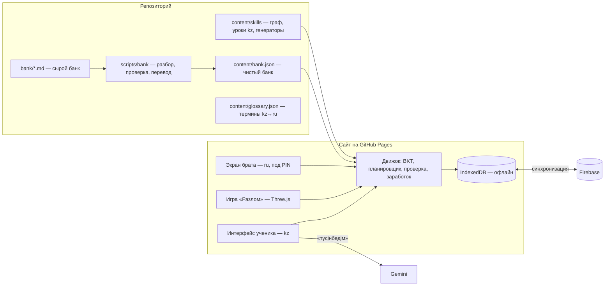

# Архитектура: сайт-подготовка к Өскемен ерлер БИЛ (версия 3.1)

Обновлено 27.09.2026 после банка задач (`bank/`), дополнения к исследованию (`reports/Дополнение 2026-09-27 БИЛ Өскемен.md`), разбора «Дарын» 2023 с генераторами (`bank/similar/README.md`) и сравнения источников (`bank/similar/COMPARISON.md`).
План работ и учёбы по датам — `docs/PLAN.md`. Игра — `docs/GAME_DESIGN.md`.

## 0. Что изменилось по сравнению с версией 2

| Было | Стало | Почему |
|---|---|---|
| Трек и язык неизвестны | **Экзамен фонда БИЛ** (bilemtihan.kz), лицей для мальчиков, код 026. **Язык обучения — казахский** | проверено по списку школ фонда; решение семьи |
| Контент на русском, «потом добавим казахский» | **Всё, что видит ученик, — на казахском с первого дня.** Экран брата — на русском | термины и числа учить сразу на языке экзамена; чтение на каз. и рус. — разные тексты |
| Банк задач «найдём потом» | **477 задач в `bank/`**, из них 165 — настоящие экзамены «Дарын» 2023–2025 и 100 — пробник Bolashak с ключом | собрано |
| Порядок тем — по школьной программе | **Порядок и веса — по частоте на реальном экзамене**, внутри — по графу зависимостей | половина экзамена — уравнения, вычисления, делимость (≈47%) |
| Визуальная логика в самом конце | **Визуальная логика (кубы, развёртки, подсчёт фигур) — с зимы 2026/27** | есть в каждом пробнике центров |
| Своя модель освоения | **Простая BKT** (4 параметра на навык, освоен при p ≥ 0,95) | стандарт; сложная адаптивность (ALEKS) в РКИ не дала эффекта |
| Пробники с января 2028 | **Мини-пробники раз в месяц с декабря 2026**, полные — с осени 2027 | эффект тренировки теста растёт с числом прогонов |
| — | **Уверенность после ответа** (сенімдімін / білмеймін) → тренирует и метакогницию, и стратегию угадывания | EEF метакогниция +8 мес; штраф −1 |
| — | **Распознавание типа задачи** и схемы для текстовых задач | Jitendra 2013, g=0,46; без повторения эффект уходит за 8 недель |
| — | **Модуль чтения на казахском** (10 вопросов = 40 из 240 баллов) | раньше не был продуман |
| — | **Сценарий для брата** из трёх вопросов | cross-age tutoring, g≈0,34 |
| Веса только по «Дарыну» | **Веса по трём группам источников**: «Дарын», задачи «реального БИЛ» из YouTube-разборов, пробник Bolashak (раздел 1) | «реальный БИЛ» похож на «Дарын», а Bolashak на 31% — визуальная логика |
| Генераторы «потом» | **Библиотека генераторов начата**: 50 шаблонов по «Дарын» 2023 (покрыта 51 задача из 55), казахский текст по оригиналу, ответы — точными дробями, неверные варианты — типичные ошибки (раздел 4.3a) | пилот 27.09.2026 |
| — | **Приём новых пробников** — постоянный процесс: каждый новый вариант разбирается, сверяется с категориями и обновляет веса (раздел 4.4a) | семья может дать ещё пробники |

Остаётся как было: всё заготовлено заранее, ИИ только кнопка «түсінбедім»; сайт на GitHub Pages; прогресс в Firebase + копия в файл; занятия только в будни; заработок игрового времени; игра «Разлом».

---

## 1. Экзамен, под который строим

| | |
|---|---|
| Лицей | Өскемен ерлер БИЛ, Лихарев к-сі 5, набор через фонд «Білім-инновация» |
| Формат | 60 вопросов / 110 мин: 50 математика+логика, 10 грамотность чтения |
| Ответы | 5 вариантов, +4 / −1, максимум 240 |
| Когда | регистрация ~1 февраля – 12 апреля 2028, экзамен в мае 2028 |
| Язык | казахский поток (решено) |
| Неизвестно | проходной балл и число мест (закрыто логином; узнать звонком в лицей) |

Официальных вариантов фонда БИЛ в открытом доступе нет. Поэтому веса считаем по трём группам источников (подробно — `bank/similar/COMPARISON.md`):

| Категория | «Дарын» (165) | «Реальный БИЛ» по YouTube (41) | Bolashak (100) | Вес в плане |
|---|---|---|---|---|
| A уравнения, выражения, модуль, неравенства | 24% | 17% | 8% | 3 |
| B текстовые: движение, работа, смеси, возраст, покупки | 14% | 20% | 6% | 3 |
| C вычисления: дроби, десятичные, периодические, степени | 13% | 15% | 14% | 3 |
| D делимость, цифры, свойства чисел | 10% | 7% | 5% | 2 |
| E геометрия с вычислением | 9% | 15% | 17% | 2 |
| F пропорции, отношения, масштаб, единицы | 8% | 10% | 6% | 2 |
| G проценты | 7% | 10% | 3% | 2 |
| H закономерности | 3% | 7% | 0% | 1 |
| I логика словами (календарь, часы, комбинаторика, взвешивания, «новая операция») | 5% | 7% | 10% | 2 |
| J визуальная логика (подсчёт фигур, развёртки, вид сбоку, замощения) | 3% | 2% | 31% | 2 |

Как читать:
- Задачи, которые авторы разборов называют «реальным БИЛ», по составу похожи на «Дарын» → база обучения — A, B, C (вес 3).
- Пробник центра Bolashak на треть состоит из визуальной логики. Реальная это особенность БИЛ или стиль центра — неизвестно, поэтому J получает вес 2 и отдельный блок в плане.
- Разделение 50 вопросов на «математику» и «логику» неизвестно (biltest считает 20 : 10).
- **Веса пересчитываются после каждого нового пробника** (раздел 4.4a). Если появится официальный вариант БИЛ, он становится главным ориентиром.

---

## 2. Общая схема



Технологии как в версии 2: TypeScript + Svelte + Vite, KaTeX, SVG для рисунков, Three.js для игры и 3D-логики, Dexie (IndexedDB), Firebase Firestore, GitHub Pages, Vitest.

---

## 3. Язык: казахский

- **Интерфейс ученика, уроки, подсказки, разборы, Бит, игра — на казахском.** Все тексты хранятся как `{ kz, ru }`: `kz` показывается ученику, `ru` — брату (экран брата, журнал ошибок) и как запасной вариант на время перевода.
- **Словарь терминов** `content/glossary.json`: бөлшек (дробь), бөлім (знаменатель), алым (числитель), ортақ бөлім, ЕҮОБ (НОД), ЕКОЕ (НОК), теңдеу, пайыз, пропорция, масштаб, модуль, қатынас… Термины берутся из казахских учебников по программе (Алдамұратова и др.). Все тексты сверяются со словарём автоматически: один термин — одно слово везде.
- **Качество казахского текста.** Уроки и разборы я пишу сразу на казахском, но у меня возможны ошибки в языке. Поэтому каждый урок имеет статус `kzReview: draft | checked`. Ученику показываются только `checked`. Проверяет носитель языка (брат, учитель, репетитор) — на экране брата есть очередь «проверить казахский текст» с кнопками «дұрыс / исправить».
- Числа: десятичная запятая, «−» для минуса, как в казахских тестах.

---

## 4. Контент

### 4.1 Граф навыков

```ts
Skill {
  id: "frac.add.unlike"
  title: { kz, ru }
  domain: "math" | "logic" | "visual" | "reading"
  grade: 5 | 6 | "olymp"
  curriculumCodes: ["5.1.2.x"]
  prereqs: [...]
  examType: "equations" | "word" | "compute" | "divisibility" | "geometry" | "proportion" | "logic" | "percent" | "patterns" | "coordinate"
  weight: 1..3                       // из таблицы раздела 1
  lessonId, generators: [...]
  misconceptions: [...]
}
```

~120–150 навыков: 5 класс, 6 класс (включая то, что школа даёт поздно: модуль, неравенства, системы, периодические дроби), логика, визуальная логика, чтение.

### 4.2 Два источника задач

| Источник | Для чего | Сколько |
|---|---|---|
| **Генераторы** (код, `content/templates/`) | массовая практика по навыку, бесконечные варианты, ответ вычисляется | готово 50 (типы «Дарын» 2023); цель ~110: + ~20 текстовых типов Bolashak/YouTube, + «Дарын» 2024, + ~30 визуальных |
| **Банк** (`bank/` → `bank.json`) | реальный экзамен: задача-цель урока, боссы, смешанная практика, пробники | 477 сырых, ~350–450 годных |

### 4.3 Схема задачи банка

```ts
BankItem {
  id: "daryn2025-07"
  source: "daryn2023" | "daryn2024" | "daryn2025" | "bolashak1" | "bolashak2" | "biltest" | "tiktok" | "youtube"
  tier: "A" | "B" | "C"              // A — настоящий экзамен, B — пробник с ключом, C — соцсети
  stem: { kz, ru }                    // kz из оригинала, где он есть
  kzOrigin: "official" | "transcribed" | "translated"
  choices: [{ kz, ru, misconception? }] x5
  answer: 0..4
  verification: "code" | "manual" | "key" | "disputed" | "unreadable"
  figure: null | { kind: "svg" | "3d" | "image", spec }
  skills: ["..."], examType, difficulty: 1..5
  solution: { kz, ru, steps: [...] }
  pool: "practice" | "boss" | "mock" | "holdout"
}
```

Правила допуска в сайт:
- только `verification ∈ { code, manual, key }`; `disputed` и `unreadable` — только после ручной правки;
- ответы из соцсетей не принимаются, только пересчитанные нами (у двух из трёх источников найдены ошибки);
- `kzOrigin: translated` — показывается ученику только после проверки носителем.

### 4.3a Генератор (шаблон задачи)

Реализовано в `content/templates/*.mjs`, проверка `npm run check:templates`, образцы `npm run samples`.

```ts
Template {
  id: "pct.drying"
  examType, skills: [...], difficulty: 1..3
  from: ["daryn2023-52"]            // реальная задача-образец
  title: { kz, ru }
  gen(rng) → {
    kz, ru,                          // условие по формулировке оригинала, новые числа/имена/предметы
    choices: [{ text, tag }] x5,     // tag — типичная ошибка («answered_dry_matter», «sign», «forgot_2»…)
    answer: 0..4,
    figure?: { kind: "svg" | "3d", ... },
    sol: { kz, ru }                  // короткое решение по шагам
  }
}
```

Правила:
- ответ вычисляется кодом точными дробями (класс `Q`), никаких округлений и ИИ;
- неправильные варианты — типичные ошибки с меткой; метка связывает вариант с заготовленным разбором ошибки;
- казахские окончания после чисел и имён ставятся функциями (`dat`, `loc`, `abl`, `genKz`, `andKz`, `datKz`, `ablKz`);
- проверка на 2000 прогонов: 5 разных вариантов, ровно один верный, нет пустых мест/NaN, есть решение, достаточное разнообразие;
- казахский текст шаблона получает `kzReview` как урок: ученику — только после проверки носителем.

### 4.4 Конвейер банка (`scripts/bank`)

```
bank/*.md (разный формат в разных файлах)
  → парсер под каждый формат → черновой JSON
  → казахский текст: «Дарын» — из PDF в bank/sources (оригинал каз.); Bolashak — расшифровка каз. части с фото; остальное — перевод + проверка
  → повторная проверка ответа кодом, где это возможно (дроби без округления)
  → разметка навыков (skills) и сложности
  → рисунки: перерисовка в SVG / 3D-спецификацию
  → валидатор: 5 вариантов, ответ среди них, термины по словарю, нет пустых полей
  → content/bank.json
```

### 4.4a Приём новых пробников

Семья может приносить новые варианты (фото, PDF, ссылки). Каждый проходит одни и те же шаги:

```
1. Источник и надёжность: официальный БИЛ / официальный «Дарын» / пробник центра с ключом / соцсети
2. Расшифровка: условие на казахском (оригинал) + русском, варианты, рисунок (описание для SVG/3D)
3. Решение и проверка кодом; сверка с ключом, если он есть; спорные — помечаются, под варианты не подгоняются
4. Категория A–J и навыки
5. Сопоставление с генераторами: «покрыто шаблоном X» или «новый тип»
6. Пересчёт долей в bank/similar/COMPARISON.md и весов в разделе 1
7. Пул: новый полный вариант по умолчанию → mock (или holdout, если он ближе всего к реальному БИЛ)
8. Новые типы → очередь генераторов
```

Приоритет источников для весов: официальный БИЛ > «реальный БИЛ» из разборов > официальный «Дарын» > пробники центров > соцсети.

### 4.5 Распределение банка по назначению

Реальных задач мало, их нельзя «сжечь» в практике:

| Пул | Что | Зачем |
|---|---|---|
| `holdout` | **«Дарын» 2025 целиком** | честный полный пробник осенью 2027 — ни одна задача не встречается раньше |
| `mock` | «Дарын» 2024, Bolashak 1 и 2, новые полные варианты от семьи | полные пробники 2027–2028 |
| `boss` + `practice` | «Дарын» 2023, biltest, TikTok, YouTube | задача-цель урока, боссы, смешанная практика, мини-пробники |

Генераторы дают массу, банк — перенос на «чужие» экзаменационные задачи.

### 4.6 Урок (заготовлен, на казахском)

```ts
Lesson {
  skillId
  goalItem: BankItem id            // реальная экзаменационная задача, которую решит после урока
  concrete: бытовой пример + SVG
  rule
  workedExamples: [полный, с 1 пропуском, с 2 пропусками]      // fading
  why: [вопрос «неге бұл қадам?» + варианты ответа]            // без этого нет переноса
  typeRecognition?: как узнать этот тип задачи + схема         // для текстовых задач
  pitfalls, altExplanation
  kzReview: "draft" | "checked"
}
```

### 4.7 Схемы для текстовых задач

Для типов «движение, работа, смеси, возраст, проценты, части» — заготовленные схемы-таблицы (например, для движения: жылдамдық × уақыт = жол, две строки — два объекта). Ученик учится: 1) узнать тип, 2) заполнить схему, 3) составить уравнение. Шаг «бұл қандай есеп?» — отдельный вопрос с вариантами. Распознавание типов повторяется по расписанию — иначе эффект уходит за ~8 недель.

### 4.8 Визуальная логика

Категория J — 31% пробника Bolashak (у «Дарына» 3%). Типы: подсчёт квадратов/треугольников/отрезков, развёртки куба и кубики с числами, вид фигуры из кубиков сбоку, кирпичи в стене, замощения и укладка фигур, площади по клеткам и составные фигуры, углы по рисунку, спички, пути по стрелкам.

- Кубы и развёртки — **Three.js** (та же технология, что в игре): фигуру можно покрутить пальцем в режиме обучения; в режиме экзамена — статичный вид, как на бумаге.
- Плоские фигуры — SVG, генерируются кодом (бесконечные варианты подсчёта фигур).
- Ответ всегда вычисляется кодом из модели фигуры.
- Задачи «найди картинку» (узлы, варежки, «какой домик другой») генерировать трудно — их перерисовываем вручную из пробников в банк.

### 4.9 Чтение (10 вопросов) — ОТЛОЖЕНО (решение 27.09.2026), описание оставлено на будущее

- Формат «Дарын» 2025: художественный текст ~230 слов, 10 вопросов, **половина — язык**: лексика, устаревшие слова, переносное значение, пунктуация, грамматика, строение предложения.
- **Стратегии** (болжау — сұрақ қою — нақтылау — мазмұндау): ~10 часов суммарно за 2–3 месяца, дальше не наращивать.
- **Фоновые знания и словарь** — долгий рычаг: 2 раза в неделю короткий казахский текст 150–300 слов (история, природа, наука, Абай и классика) + 3–5 вопросов, из них 1–2 на лексику/грамматику.
- Тексты — только проверенные человеком; источники: открытые тексты (Дарын, ЕНТ-спецификация, казахская классика в общественном достоянии).
- Тактика: сначала читать текст, потом вопросы.

---

## 5. Как сайт учит новую тему

```
0. Предпроверка        2 задачи; обе верно → сразу к шагу 6
1. Мақсат (цель)       реальная экзаменационная задача из банка, которую пока нельзя решить
2. Урок                пример → картинка → правило, вопрос после каждого шага
3. Разбор с пропусками полный → 1 пропуск → 2 пропуска
4. «Неге?»             выбрать верное объяснение шага
5. Тип задачи          (для текстовых) узнать тип, заполнить схему
6. Практика            генераторы, от лёгкого к трудному, лестница подсказок, разбор сразу
7. Уверенность         после каждого ответа: «сенімдімін / шамамен / білмеймін»
8. Проверка            задачи без подсказок до p ≥ 0,95 → «үйренді»
9. Отложенная проверка через 1–3 учебных дня без подсказок и без ИИ → «меңгерді»
10. Финал              задача из шага 1 — решает сам
```

Лестница подсказок, «если застрял», пошаговая проверка — как в версии 2 (всё заготовлено; ИИ только после запасного объяснения).

**Уверенность (шаг 7)** даёт две вещи:
- метакогницию: сайт показывает «ты был уверен и ошибся» — это тема для разбора;
- калибровку для экзамена: видно, насколько его «шамамен» (примерно) совпадает с правдой — отсюда личное правило угадывания.

---

## 6. Модель ученика: простая BKT

На каждый навык 4 числа: p(знал заранее), p(научился за попытку), p(ошибся, зная), p(угадал). Стартовые значения одинаковые для всех навыков (для choice5 угадывание 0,2; для ввода числа ~0,02), подстройка — позже по данным.

- Попытка с подсказкой обновляет модель слабее; после полного разбора — не обновляет.
- `үйренді` при p ≥ 0,95; `меңгерді` после отложенной проверки; дальше — интервальные повторения (1 → 3 → 7 → 16 → 35 учебных дней), провал → обратно в практику.
- Никакой сложной адаптивности: РКИ ALEKS (~2500 учеников) не показало эффекта от «умного» подбора. Силы — в контент и обратную связь.

Отдельно храним: скорость (для экзаменационного режима), калибровку уверенности, типичные ошибки, частоту подсказок.

---

## 7. Планировщик

### 7.1 Дневной план (будни, ~40 мин)

| Блок | Мин | Что |
|---|---|---|
| Разминка | 6 | повторения вперемешку + 1–2 вопроса «бұл қандай есеп?» |
| Жаңа (новое) | 18 | урок или продолжение навыка |
| Аралас (смешанное) / босс | 10 | недавние темы вперемешку, реальные задачи из банка, логика |
| Оқу (чтение) | 0 / 15 | 2 раза в неделю вместо части смешанного блока |
| Қорытынды (итог) | 2 | «не түсіндім?», начисление времени |

Раз в месяц один будний день целиком — мини-пробник (20 задач, 35 мин) вместо плана.

### 7.2 Пробники

| Когда | Что | Разбор |
|---|---|---|
| с дек 2026, раз в месяц | мини-пробник 20 задач по пройденному, +4/−1, таймер мягкий | после теста |
| с сен 2027, раз в месяц | полный 60/110 | после теста |
| янв – май 2028, раз в 2 недели | полный 60/110 | после теста + план слабых мест |
| окт–нояб 2027 | **holdout: «Дарын» 2025** | честная оценка уровня |

В тренировке разбор сразу, в пробнике — только после всего теста.

### 7.3 Стратегия угадывания (штраф −1)

Наугад из 5 → в среднем 0. Исключил хотя бы один вариант → отвечай (+0,25 в среднем). Учим явно, тренируем в мини-пробниках, в разборе показываем: «здесь пропуск стоил бы +1, угадывание дало −1» и наоборот. Осторожным ученикам важно не пропускать то, что знают частично.

### 7.4 Скорость

Таймер — только по навыкам в статусе `меңгерді`. Точность и скорость меряются отдельно. Цель к маю 2028: ~1,8 мин на задачу.

---

## 8. Брат как репетитор

- **Сценарий из трёх вопросов** (всплывает на экране брата и на карточке «ағаңа түсіндір»):
  1. Не берілген? (что дано)
  2. Не табу керек? (что найти)
  3. Бірінші қадам қандай? (какой первый шаг)
- Брат закрепляет, а не объясняет новое — новое даёт урок.
- На экране брата (ru): что сегодня прошёл, где «был уверен и ошибся», очередь проверки казахских текстов, быстрые исключения (болел, праздник).

---

## 9. Заработок игрового времени

Правило семьи (без изменений): в будни за дневной план — до **60 мин сегодня** и до **48 мин в копилку выходных** (итого до 4 часов на выходные), пропорционально доле выполненного плана, только за честные задачи.

Исследования советуют награждать **за освоение и прогресс**, а не за факт занятия. Поэтому дополнительно:
- «доля плана» считает не минуты, а блоки: новое засчитано, если урок пройден и практика дошла до конца; повторения — если сделаны;
- бонусы (неожиданные, +10–15 мин) — только за освоенный навык, пройденную отложенную проверку, побеждённого босса;
- *опция на выбор брата:* копилку выходных начислять за прогресс недели (освоенные навыки + отложенные проверки), а будничный час — за план.

Честные задачи, экран времени, PIN, исключения — как в версии 2.

---

## 10. ИИ (Gemini)

Как в версии 2: только кнопка «Түсінбедім, басқаша түсіндірші» после запасного объяснения. Промпт требует отвечать на казахском, простыми словами, числа только из заготовленного решения, не называть ответ нерешённой задачи. В ИИ уходят только учебные данные. Проверить условия Gemini API (возраст, данные на бесплатном уровне) до включения.

ИИ также помогает офлайн: черновой перевод задач банка на казахский и черновики уроков — всё с проверкой носителем.

---

## 11. Игра

`docs/GAME_DESIGN.md` без изменений по сути. Уточнения:
- **Боссы** используют реальные задачи из пулов `boss` / `practice`; финальные боссы сезонов — мини-пробники.
- **Арена** — пробники, включая holdout «Дарын» 2025 как «Глитч-босс сезона» осенью 2027.
- Весь текст игры и Бит — на казахском.
- 3D-движок игры переиспользуется для визуальной логики (кубы, развёртки).

---

## 12. Данные

Firestore + IndexedDB:

```
profile      { nickname, lang: "kz", settings, pinHash }
attempts     { item, skills, answer, correct, confidence, honest, hintLevel, aiUsed, stepErrors, timeMs, mode, at }
skillState   { skill → bkt{pKnow}, status, stability, due, misconceptions }
days         { date → planBlocks, planShare, minutesToday, minutesWeekend, bonuses, exceptions }
mocks        { variant, score240, perType, timePerQ, guesses, skipped, calibration, at }
kzReview     { contentId → status, fixes }
aiLog        { item, question, answer, at }
```

---

## 13. Качество

- Автотесты генераторов (тысячи вариантов, ответ проверяется вторым способом).
- Валидатор банка: 5 вариантов, ответ среди них, терминология по словарю, нет `disputed` в пулах.
- Тест «holdout не протекает»: задачи «Дарын» 2025 не встречаются нигде, кроме пробника.
- Провокации для ИИ (на казахском и русском).
- Метрики: точность на отложенных задачах без помощи, балл мини-пробников в шкале 240, калибровка уверенности.

---

## 14. Открытые вопросы

1. **Кто проверяет казахский текст?** Ты, учитель, репетитор? Без этого уроки нельзя показывать.
2. Экран брата — на русском (предполагаю) или тоже на казахском?
3. Проходной балл и число мест — звонок в лицей: 8 705 187 58 01.
4. Подаваться ли дополнительно на «Дарын» (гимназия им. Жамбыла, каз. поток) — тогда +10 вопросов по истории Казахстана.
5. Опция копилки «за прогресс недели» (раздел 9) — включать?
6. Новые пробники: особенно ценны полные варианты с ключом и всё, что выдаётся за официальный БИЛ. Принимаются по процессу 4.4a.
