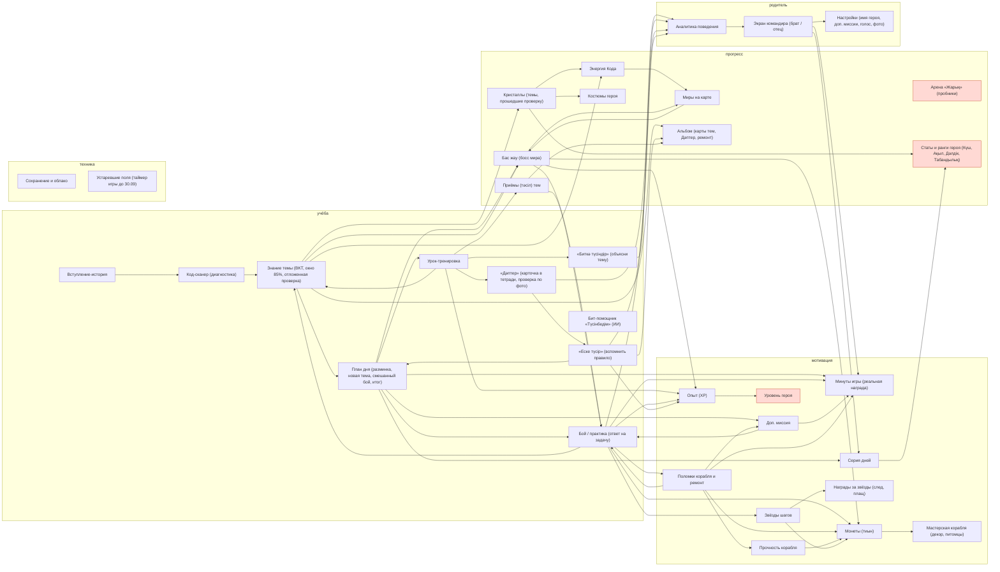

# Карта систем

Собирается автоматически из `content/systems.mjs` командой `npm run systems`; руками не править. Тест `tests/systems.test.ts` следит, чтобы карта совпадала с кодом.

**Правило проекта:** новая механика или новое поле сохранения сначала вписывается в `content/systems.mjs` (что её питает, что она открывает, где видна), потом пишется код. Числа баланса — в одном месте (см. `docs/systems/constants.md`).

## Проверки: 4 в порядке, 11 нарушено

| | Проверка | Подробности |
|---|---|---|
| ❌ | У каждой механики есть вход (что её питает) | arena |
| ❌ | Каждая механика что-то открывает или на что-то влияет (нет «сирот») | растут, но ничего не открывают: level, arena, hero-stats |
| ❌ | Каждое правило определено в одном месте | «быстро / наугад» — 5 определений; «точность» — 4 определения; «расписание повторения темы» — 3 определения; ««меңгерілді» (тема освоена)» — 3 определения; «энергия» — 2 определения; ««честный ответ» и «доля честных»» — 5 определений; «где хранится «тема пройдена / изучена»» — 3 определения; «половинные монеты при поломках» — 2 определения; «босс доступен» — 2 определения |
| ❌ | Монетам до экзамена есть на что тратиться | магазин выкуплен 2026-11-02, до экзамена ещё 560 дн.; к экзамену на руках 30924 монет |
| ❌ | Звёзды до экзамена что-то открывают | все награды за звёзды получены 2026-10-07, потом ещё 2556 звёзд впустую |
| ❌ | Все костюмы достижимы с текущим контентом | нужно кристаллов 45, тем с уроками 42 |
| ❌ | Все миры достижимы с текущим контентом | нужно энергии 135, максимум 84 |
| ❌ | У арены есть путь открытия | арена закрыта всегда (нет режима пробников) |
| ❌ | Корабль можно держать целым (ремонт успевает за ошибками) | после первого месяца корабль разбит (0%) в 100% дней; к экзамену поломок 526 |
| ❌ | Главный документ облака не подходит к пределу Firestore (1 МБ) до экзамена | к экзамену ≈ 749 КБ (дни с планом, поломки навсегда, журнал ИИ) |
| ❌ | В сохранении нет мёртвых полей (пишутся, но не читаются; устаревшие) | 14: settings.planMinutes, levelStars, skills[].correct, repairShop[].source / .tag, recall[].history[].task, recall[].learnedDay, notebook[].check.fix / .tries / .at, aiLog[].at, usage[].screens, usage events mic / finalMiss, recallOffer[].skipped, attempts[].mode lesson/diagnostic/mock, attempts[].selfCheck / .kind, weekendSpent, days[].spent, bonuses[].mastery |
| ✅ | Все связи на карте ведут к существующим механикам | ок |
| ✅ | Файлы кода на карте существуют | ок |
| ✅ | Каждое поле сохранения принадлежит механике на карте | ок |
| ✅ | Хороший ученик зарабатывает не меньше 45 мин в будний день | в среднем 55 мин при точности 85% |

## Связи

## Учёба

| Механика | Питается от | Открывает / влияет | Видно | Данные | Код | Заметки |
|---|---|---|---|---|---|---|
| **Вступление-история** | — | Код-сканер (диагностика) | ребёнку | `introSeen` | `src/screens/Intro.svelte` `content/intro.mjs` |  |
| **Код-сканер (диагностика)** | Вступление-история | Знание темы (BKT, окно 85%, отложенная проверка) | ребёнку | `diagnosticDone` | `src/screens/Diagnostic.svelte` | тема «знает» = 2 верных подряд; верный быстрее 3 с считается провалом; прогресс скана не сохраняется |
| **План дня (разминка, новая тема, смешанный бой, итог)** | Знание темы (BKT, окно 85%, отложенная проверка), «Еске түсір» (вспомнить правило) | Урок-тренировка, Бой / практика (ответ на задачу), Минуты игры (реальная награда), Серия дней, Бас жау (босс мира), Доп. миссия | ребёнку | `days` | `src/engine/planner.ts` `src/lib/session.svelte.ts` `src/screens/Hub.svelte` | шаги идут «до N верных»; «Еске түсір» обязателен перед планом |
| **Урок-тренировка** | План дня (разминка, новая тема, смешанный бой, итог) | Знание темы (BKT, окно 85%, отложенная проверка), Опыт (XP), Приёмы (тәсіл) тем, «Биткә түсіндір» (объясни тему), «Дәптер» (карточка в тетради, проверка по фото) | ребёнку | `lessonPos` | `src/screens/Lesson.svelte` `content/lessons.mjs` | ошибки урока в модель знаний не идут |
| **«Биткә түсіндір» (объясни тему)** | Урок-тренировка | Аналитика поведения | ребёнку |  | `src/lesson/TeachBack.svelte` `helper/teachback.mjs` | итог (понял / частично) ни на что, кроме журнала, не влияет |
| **«Дәптер» (карточка в тетради, проверка по фото)** | Урок-тренировка | «Еске түсір» (вспомнить правило), Аналитика поведения | ребёнку | `notebook` | `src/lesson/NotebookCard.svelte` `helper/notebook.mjs` |  |
| **Бой / практика (ответ на задачу)** | План дня (разминка, новая тема, смешанный бой, итог), Доп. миссия, Поломки корабля и ремонт, Бас жау (босс мира) | Знание темы (BKT, окно 85%, отложенная проверка), Опыт (XP), Монеты (тиын), Звёзды шагов, Минуты игры (реальная награда), Поломки корабля и ремонт, Аналитика поведения | ребёнку | `attempts` | `src/screens/Session.svelte` `src/engine/rush.ts` `src/engine/confidence.ts` `src/engine/twin.ts` | внутри: уверенность, самопроверка, ход Глитча, разбор ошибки, задачи-близнецы, подсказки |
| **Знание темы (BKT, окно 85%, отложенная проверка)** | Бой / практика (ответ на задачу), Код-сканер (диагностика), Урок-тренировка | План дня (разминка, новая тема, смешанный бой, итог), Кристаллы (темы, прошедшие проверку), Энергия Кода, Бас жау (босс мира), Альбом (карты тем, Дәптер, ремонт) | обоим | `skills` | `src/engine/progress.ts` `src/engine/bkt.ts` | проваленная проверка снимает кристалл (откат в «изучается») |
| **«Еске түсір» (вспомнить правило)** | «Дәптер» (карточка в тетради, проверка по фото) | План дня (разминка, новая тема, смешанный бой, итог), Опыт (XP), Альбом (карты тем, Дәптер, ремонт), Аналитика поведения | ребёнку | `recall`, `recallOffer` | `src/screens/Recall.svelte` `src/engine/recall.ts` | своё расписание (календарные дни) отдельно от отложенной проверки (учебные дни); «зачтено» (3 возврата) не влияет на знание темы |
| **Бит-помощник «Түсінбедім» (ИИ)** | Бой / практика (ответ на задачу), Урок-тренировка | — (итог) | ребёнку | `aiLog` | `src/lib/helper.ts` `helper/server.mjs` |  |

## Мотивация

| Механика | Питается от | Открывает / влияет | Видно | Данные | Код | Заметки |
|---|---|---|---|---|---|---|
| **Минуты игры (реальная награда)** | План дня (разминка, новая тема, смешанный бой, итог), Бой / практика (ответ на задачу), Доп. миссия, Поломки корабля и ремонт, Экран командира (брат / отец) | — (итог) | обоим |  | `src/engine/planner.ts` | до 60 за план + 15 за доп. миссию; доля «как на экзамене» (+1 / −¼ / 0) |
| **Доп. миссия** | План дня (разминка, новая тема, смешанный бой, итог), Поломки корабля и ремонт | Бой / практика (ответ на задачу), Минуты игры (реальная награда) | ребёнку |  | `src/screens/Session.svelte` `src/engine/planner.ts` | засчитывается при 7 верных с первой попытки из 10; при ≥3 поломках — ремонтная |
| **Поломки корабля и ремонт** | Бой / практика (ответ на задачу) | Прочность корабля, Бой / практика (ответ на задачу), Доп. миссия, Минуты игры (реальная награда), Монеты (тиын) | ребёнку | `repairShop`, `shipChestFixed` | `src/engine/repair.ts` `src/screens/Album.svelte` | поломка — любая ошибка, не устаревает; починка сегодняшней ошибки возвращает минуты |
| **Прочность корабля** | Поломки корабля и ремонт | Монеты (тиын) | обоим |  | `src/engine/repair.ts` `src/screens/Hub.svelte` | с 7 поломок монеты вдвое; целый корабль после 5 починок — сундук |
| **Монеты (тиын)** | Бой / практика (ответ на задачу), Бас жау (босс мира), Поломки корабля и ремонт, Прочность корабля | Мастерская корабля (декор, питомцы) | ребёнку | `coins` | `src/lib/ship.svelte.ts` `content/ship_items.mjs` |  |
| **Мастерская корабля (декор, питомцы)** | Монеты (тиын) | — (итог) | ребёнку | `shipOwned`, `shipPet` | `src/screens/Workshop.svelte` `content/ship_items.mjs` | 22 предмета на 2235 монет — конечный каталог |
| **Опыт (XP)** | Бой / практика (ответ на задачу), Урок-тренировка, «Еске түсір» (вспомнить правило), Бас жау (босс мира) | Уровень героя | ребёнку | `xp` | `src/screens/Session.svelte` `src/screens/Lesson.svelte` | даётся и за верный ответ наспех |
| **Уровень героя** | Опыт (XP) | **ничего** | ребёнку |  | `src/engine/level.ts` `src/screens/Hub.svelte` | ничего не открывает: только окно «Жаңа деңгей» |
| **Звёзды шагов** | Бой / практика (ответ на задачу) | Награды за звёзды (след, плащ), Монеты (тиын) | ребёнку | `levelStars` | `src/screens/Session.svelte` `src/lib/look.ts` | levelStars пишется, но нигде не читается; звёзды босса не засчитываются |
| **Награды за звёзды (след, плащ)** | Звёзды шагов | — (итог) | ребёнку | `style` | `content/worlds.mjs` `src/screens/Hero.svelte` | все 8 наград — за 45 звёзд (1–2 недели) |
| **Серия дней** | План дня (разминка, новая тема, смешанный бой, итог), Экран командира (брат / отец) | Статы и ранги героя (Күш, Ақыл, Дәлдік, Табандылық) | обоим |  | `src/engine/streak.ts` | заморозки: 2 на всю серию (комментарий обещает 2 в месяц), ребёнок их не видит |

## Прогресс

| Механика | Питается от | Открывает / влияет | Видно | Данные | Код | Заметки |
|---|---|---|---|---|---|---|
| **Кристаллы (темы, прошедшие проверку)** | Знание темы (BKT, окно 85%, отложенная проверка) | Энергия Кода, Костюмы героя, Статы и ранги героя (Күш, Ақыл, Дәлдік, Табандылық) | ребёнку |  | `src/lib/look.ts` | показаны в 5 местах; при проваленной проверке отнимаются |
| **Энергия Кода** | Знание темы (BKT, окно 85%, отложенная проверка), Кристаллы (темы, прошедшие проверку) | Миры на карте | ребёнку |  | `content/worlds.mjs` `src/screens/Map.svelte` | на корабле портал светится по другой формуле (изученные темы mod 10) |
| **Миры на карте** | Энергия Кода, Бас жау (босс мира) | Бас жау (босс мира) | ребёнку | `world`, `worldsCleared` | `content/worlds.mjs` `src/lib/look.ts` `src/screens/Map.svelte` | мир только меняет небо и монстров; при потере энергии может закрыться снова |
| **Бас жау (босс мира)** | План дня (разминка, новая тема, смешанный бой, итог), Миры на карте, Знание темы (BKT, окно 85%, отложенная проверка) | Миры на карте, Бой / практика (ответ на задачу), Опыт (XP), Монеты (тиын) | ребёнку |  | `src/screens/Map.svelte` `src/screens/Session.svelte` | одна попытка в день; условие «босс готов» записано в двух местах по-разному |
| **Арена «Жарық» (пробники)** | — | **ничего** | ребёнку |  | `content/worlds.mjs` `src/lib/look.ts` | всегда закрыта: режима пробников нет |
| **Костюмы героя** | Кристаллы (темы, прошедшие проверку) | — (итог) | ребёнку | `outfit` | `content/worlds.mjs` `src/screens/Hero.svelte` |  |
| **Статы и ранги героя (Күш, Ақыл, Дәлдік, Табандылық)** | Кристаллы (темы, прошедшие проверку), Знание темы (BKT, окно 85%, отложенная проверка), Бой / практика (ответ на задачу), Серия дней | **ничего** | ребёнку |  | `src/screens/Hero.svelte` | ранги ничего не открывают |
| **Приёмы (тәсіл) тем** | Урок-тренировка | Альбом (карты тем, Дәптер, ремонт), Бой / практика (ответ на задачу) | ребёнку |  | `content/techniques.mjs` `src/lesson/TechCard.svelte` | только вид и цвет удара |
| **Альбом (карты тем, Дәптер, ремонт)** | Знание темы (BKT, окно 85%, отложенная проверка), «Еске түсір» (вспомнить правило), Приёмы (тәсіл) тем, Поломки корабля и ремонт | — (итог) | ребёнку |  | `src/screens/Album.svelte` |  |

## Родитель

| Механика | Питается от | Открывает / влияет | Видно | Данные | Код | Заметки |
|---|---|---|---|---|---|---|
| **Экран командира (брат / отец)** | Аналитика поведения, Знание темы (BKT, окно 85%, отложенная проверка), План дня (разминка, новая тема, смешанный бой, итог) | Минуты игры (реальная награда), Серия дней, Настройки (имя героя, доп. миссии, голос, фото) | командиру | `kzReview` | `src/screens/Commander.svelte` | подарки +10/+15 мин без лимита; если PIN не задан, его может придумать ребёнок |
| **Настройки (имя героя, доп. миссии, голос, фото)** | Экран командира (брат / отец) | — (итог) | командиру | `settings`, `heroName` | `src/screens/Commander.svelte` `src/lib/store.svelte.ts` | settings.planMinutes нигде не читается |
| **Аналитика поведения** | Бой / практика (ответ на задачу), Урок-тренировка, «Биткә түсіндір» (объясни тему), «Дәптер» (карточка в тетради, проверка по фото), «Еске түсір» (вспомнить правило) | Экран командира (брат / отец) | командиру | `usage` | `src/lib/track.svelte.ts` `src/engine/analytics.ts` |  |

## Техника

| Механика | Питается от | Открывает / влияет | Видно | Данные | Код | Заметки |
|---|---|---|---|---|---|---|
| **Сохранение и облако** | — | — (итог) | — | `version`, `updatedAt`, `lastBackup` | `src/lib/store.svelte.ts` `src/lib/cloud.svelte.ts` `src/engine/sync.ts` |  |
| **Устаревшие поля (таймер игры до 30.09)** | — | — (итог) | — | `weekendSpent` | `src/engine/types.ts` | остались в старых сохранениях; удалить миграцией |

## Мёртвые поля сохранения

| Поле | Что не так |
|---|---|
| `settings.planMinutes` | пишется, нигде не читается (план — 36 мин весом блоков) |
| `levelStars` | пишется, нигде не читается; дублирует days[].stars |
| `skills[].correct` | пишется, нигде не читается; дублирует историю ответов |
| `repairShop[].source / .tag` | пишутся, ремонт берёт только тему |
| `recall[].history[].task` | пишется, нигде не читается |
| `recall[].learnedDay` | читается только при создании; дублирует skills[].learnedAt и notebook[].day |
| `notebook[].check.fix / .tries / .at` | пишутся, нигде не читаются |
| `aiLog[].at` | пишется, нигде не читается |
| `usage[].screens` | пишется каждые 5 с, нигде не читается |
| `usage events mic / finalMiss` | пишутся, аналитика их не показывает |
| `recallOffer[].skipped` | читается командиром, но с 02.10 не пишется (пропуска нет) |
| `attempts[].mode lesson/diagnostic/mock` | такие значения не пишутся никогда: ошибки урока и диагностики не попадают в историю |
| `attempts[].selfCheck / .kind` | пишутся, но не объявлены в типе Attempt |
| `weekendSpent, days[].spent, bonuses[].mastery` | устаревшие (таймер игры и бонусы за освоение убраны) |

## Понятия, у которых должно быть одно определение

**быстро / наугад** — 5 определений ❌
- `src/engine/rush.ts + Session.svelte`: 2,5–8 с по длине условия, личный порог 5–25 с только для неверных
- `src/engine/answers.ts (Commander «Ответы»)`: фиксированные 5 с
- `src/screens/Recall.svelte`: isHonest по умолчанию: 5 с
- `src/screens/Diagnostic.svelte`: верно только если дольше 3 с
- `src/screens/Commander.svelte «Сегодня»`: «угадываний» = !honest, подпись «быстрее 5 сек»

**точность** — 4 определения ❌
- `src/screens/Hero.svelte «Дәлдік»`: честные без подсказки за 14 дней, от 10 ответов
- `src/screens/Summary.svelte «дәлдік»`: все попытки дня, включая близнецов и вспоминание
- `src/screens/Session.svelte звёзды`: верные с первой попытки в бою
- `src/screens/Commander.svelte`: «верно с первой попытки» и «верно / честно»

**расписание повторения темы** — 3 определения ❌
- `src/engine/progress.ts INTERVALS`: 1, 3, 7, 16, 35 учебных дней
- `src/engine/recall.ts GAPS`: 1, 2, 4, 7, 16, 30, 45, 60 календарных дней
- `src/engine/recall.ts WINDOWS (подписи в Альбоме)`: 1, 3–4, 7–10, 14–21, 30–45 дней

**«меңгерілді» (тема освоена)** — 3 определения ❌
- `src/engine/progress.ts`: статус mastered после отложенной проверки (кристалл)
- `src/engine/recall.ts isCredited`: 3 чистых вспоминания
- `src/screens/Lesson.svelte`: «МЕҢГЕРІЛДІ!» — приём урока после финала

**энергия** — 2 определения ❌
- `content/worlds.mjs codeEnergy`: изучена +1, освоена +2
- `src/screens/Hub.svelte setEnergy`: изученные темы mod 10

**«честный ответ» и «доля честных»** — 5 определений ❌
- `src/screens/Session.svelte (ответ)`: не свёрнуто > 3 с, не быстрее порога спешки, без полного разбора
- `src/screens/Recall.svelte`: жёсткие 5 с, свёрнутое приложение не учитывается
- `src/screens/Session.svelte звёзды`: honestShare = (ответы − наспех) / ответы
- `DayRecord.honest`: на деле балл «как на экзамене» (+1 / −¼ / 0), а не доля честных
- `src/engine/analytics.ts «честно %»`: доля honest=true вместе с задачами вспоминания

**где хранится «тема пройдена / изучена»** — 3 определения ❌
- `skills[].lessonDone / learnedAt`: урок пройден, дата изучения
- `recall[id].learnedDay`: дата для «Еске түсір»
- `notebook[id].day`: дата карточки «Дәптер»

**половинные монеты при поломках** — 2 определения ❌
- `src/engine/confidence.ts HALF_COINS_OVER`: > 6
- `src/engine/repair.ts COINS_HALF_FROM`: ≥ 7

**босс доступен** — 2 определения ❌
- `src/screens/Hub.svelte`: будни, план, ≥3 изученных, мир не пройден, не пробовал
- `src/screens/Map.svelte`: будни, план, ≥3 изученных, не пробовал (без «мир не пройден»)

## Симуляция ученика

Модель (`src/engine/sim.ts`), а не ребёнок: точность 85%, 4 новые темы в неделю, доп. миссия через день, 6 тем засчитано диагностикой, с 2026-09-28 до экзамена 2028-05-15. Уроков в контенте: 36. Магазин: 22 предметов на 2235 монет.

- магазин выкуплен: **2026-11-02**
- все награды за звёзды: **2026-10-07**
- уроки закончились: **2026-11-27**
- все костюмы: **недостижимы**
- все миры: **недостижимы**

| День | Учебных дней | Монеты (на руках / потрачено) | Предметов | Звёзды | Наград за звёзды | Уровень | Тем изучено / кристаллов | Энергия | Миров | Костюмов | Поломок | Корабль | Минут в день | Облако, КБ |
|---|---|---|---|---|---|---|---|---|---|---|---|---|---|---|
| 2026-10-05 | 6 | 14 / 595 | 11 | 36 | 7 | 12 | 9 / 1 | 10 | 2 | 1 | 7 | 30% | 60 | 217 |
| 2026-10-28 | 23 | 35 / 1985 | 21 | 138 | 8 | 20 | 22 / 14 | 36 | 5 | 4 | 31 | 0% | 50 | 238 |
| 2026-11-27 | 45 | 1584 / 2235 | 22 | 270 | 8 | 25 | 40 / 33 | 73 | 8 | 7 | 59 | 0% | 50 | 266 |
| 2027-01-06 | 73 | 3740 / 2235 | 22 | 438 | 8 | 28 | 42 / 36 | 78 | 8 | 7 | 93 | 0% | 50 | 302 |
| 2027-04-16 | 145 | 9284 / 2235 | 22 | 870 | 8 | 33 | 42 / 36 | 78 | 8 | 7 | 182 | 0% | 50 | 392 |
| 2027-07-25 | 215 | 14674 / 2235 | 22 | 1290 | 8 | 35 | 42 / 36 | 78 | 8 | 7 | 269 | 0% | 0 | 482 |
| 2027-11-02 | 287 | 20218 / 2235 | 22 | 1722 | 8 | 37 | 42 / 36 | 78 | 8 | 7 | 358 | 0% | 50 | 573 |
| 2028-05-15 | 426 | 30924 / 2235 | 22 | 2556 | 8 | 40 | 42 / 36 | 78 | 8 | 7 | 526 | 0% | 60 | 749 |

